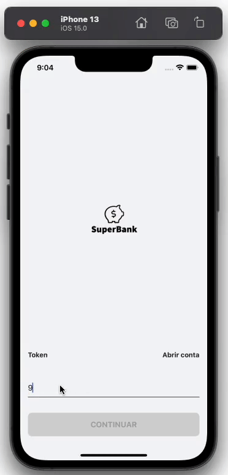

 

  <h3 align="center">SuperBank</h3>

  

    Banco digital
  

  
Índice

    <ol>
    <li>
      <a href="#sobre-o-projeto">Sobre o projeto</a>
      <ul>
        <li><a href="#funcionalidades">Funcionalidades</a></li>
        <li><a href="#construido-com">Construido com</a></li>
      </ul>
    </li>
    <li><a href="#contato">Contato</a></li>
  </ol>

## Sobre o projeto

Esse projeto consiste na criação de um banco digital, com a intenção de reunir diversos conhecimentos, design pattern e boas práticas em um único projeto para possíveis consultas.

### Funcionalidades

  * Abrir conta

    Na criação de conta é solicitado ao cliente algumas informações necessárias e durante esse processo algumas informações são consultadas para validar se já existe algum cliente com os mesmos dados, como por exemplo o CPF ou o email.

    

  * Login
  
    No Login o cliente insere seu número de conta, onde será validado, caso o número seja válido será solicitado ao cliente sua senha e após inseri-lá, o cliente receberá acesso a sua conta.

    

  * Solicitar cartão

    Após abrir uma conta o cliente pode solicitar um cartão, onde ele ter um overview sobre os benefícios do cartão e em seguida ele escolher o valor de limite (o limite máximo é gerado de forma aleatória), depois o cliente seleciona o dia do vencimento da sua fatura e insere uma senha para cartão. Após isso é só confirmar os dados e o cliente já tem acesso a sua fatura de crédito, ao status do envio do cartão e aos seus cartões, onde é possível adicionar um cartão virtual.

    

  * Meus cartões
  
    Nessa tela o cliente pode ver seus cartões físicos e virtuais, podendo criar um novo cartão virtual com um nome personalizado para facilitar a identificação das compras. O cliente também pode bloquear o cartão e/ou bloquear as compras internacionais, tanto do cartão físico como do virtual.

    
    
### Construído com

Na construção do projeto está sendo utilizado uma arquitetura modular, que traz como benefício o isolamento de alterações, a capacidade de trabalhar em partes isoladas e um menor tempo de compilação.

Também é utilizado o Coodinator Pattern, que fornece um encapsulamento da lógica de navegação e ajuda a combater as famosas Massive View Controller.

No projeto é utilizado o Firestore do [Firebase](https://firebase.google.com/), para armazenar as informações utilizadas no aplicativo, como informações de cliente, contas, login…

Também está sendo utilizado algumas bibliotecas, como [RxSwift](https://github.com/ReactiveX/RxSwift). Alguns design arquitetônico, como MVC e MVVM. E alguns padrões criacionais, como o Singleton.

## Contato

William James - william.james.pj@gmail.com

Link do projeto: [https://github.com/william-james-pj/SuperBankSwift](https://github.com/william-james-pj/SuperBankSwift)
